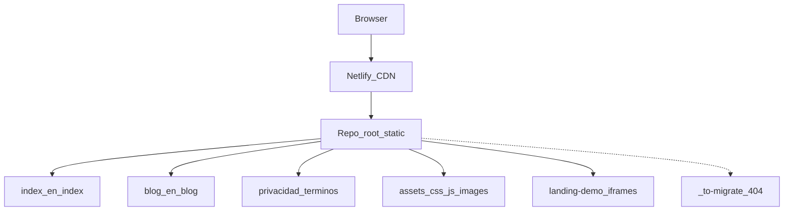

# Architecture — tuko-landing

## Vista general

## Decisiones (cleanup 2026-10)

| Decisión | Motivo |
|----------|--------|
| Netlify only (`netlify.toml` + `_redirects` + `_headers`) | Hosting real; `.htaccess` eliminado |
| Legales en raíz; `/pages/*` → 301 | Una URL canónica |
| `blog-cms` → `_to-migrate/` + 404 | No pertenece a la landing publicada |
| GA4 tras consentimiento | RGPD |
| Home CSS/JS externos | Mantenibilidad; HTML ~1k líneas |
| Imágenes WebP + kebab + srcset banners | Peso ~52 MB → ~2 MB |
| `landing-demo/` se mantiene | Enlazado desde el home (iframes) |
| `natrue-x-tuko` se mantiene | Post de blog vivo + redirects |

## i18n

Hoy: diccionarios en `home-ui.js` + `i18n.js` + HTML espejo `en/`. Propuesta futura: [`docs/I18N-PROPOSAL.md`](./docs/I18N-PROPOSAL.md).

## Seguridad / secretos

- `.gitignore` cubre `.env*`, `*.pem`, `node_modules`, settings locales.
- Secretos locales del CMS (si existen) no deben publicarse; carpeta migrada fuera de la superficie útil.
