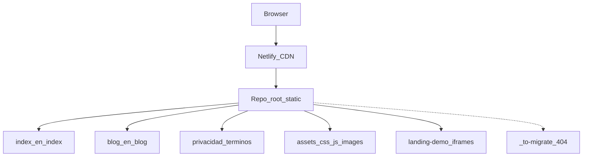

# Architecture — tuko-landing

## Vista general

## Decisiones (cleanup 2026-10)

| Decisión | Motivo |
|----------|--------|
| Netlify only (`netlify.toml` + `_redirects` + `_headers`) | Hosting real; `.htaccess` eliminado |
| Legales en raíz; `/pages/*` → 301 | Una URL canónica |
| `blog-cms` → `_to-migrate/` + 404 | No pertenece a la landing publicada |
| GA4 tras consentimiento | RGPD |
| Home CSS/JS externos | Mantenibilidad; HTML ~1k líneas |
| Imágenes WebP + kebab + srcset banners | Peso ~52 MB → ~2 MB |
| `landing-demo/` se mantiene | Enlazado desde el home (iframes) |
| Consent en legales + `tuko-ai` (Sprint 2) | Misma puerta GA4 en toda la superficie útil |
| OG v2–v7 eliminados; png + v8 pendientes de unificar | Evitar assets muertos; Joan elige definitiva |
| Posts ES-only sin hreflang `en` a 404 | SEO; EN selector → índice EN |
| Natrue republicado ES/EN como HTML estático | Hub lo despublicó 2026-09-24; restaurado en Sprint 3 |
| `primer-articulo` retirado → `/blog/` | Borrador huérfano fuera de índice |
| Redirects zombi `_versiones` / `_originales-png` eliminados | Carpetas inexistentes |
| Norte: `publish = "site"` (pendiente PR B) | Dejar de servir docs/scripts/AGENTS |

Lighthouse Sprint 2: [`docs/LIGHTHOUSE-2026-10.md`](./docs/LIGHTHOUSE-2026-10.md). Opinión Sprint 3: [`docs/SPRINT3-CTO-OPINION.md`](./docs/SPRINT3-CTO-OPINION.md). Resumen: [`docs/CLEANUP-SUMMARY.md`](./docs/CLEANUP-SUMMARY.md).

## i18n

Hoy: diccionarios en `home-ui.js` + `i18n.js` + HTML espejo `en/`. Propuesta futura: [`docs/I18N-PROPOSAL.md`](./docs/I18N-PROPOSAL.md).

## Seguridad / secretos

- `.gitignore` cubre `.env*`, `*.pem`, `node_modules`, settings locales.
- Secretos locales del CMS (si existen) no deben publicarse; carpeta migrada fuera de la superficie útil.
