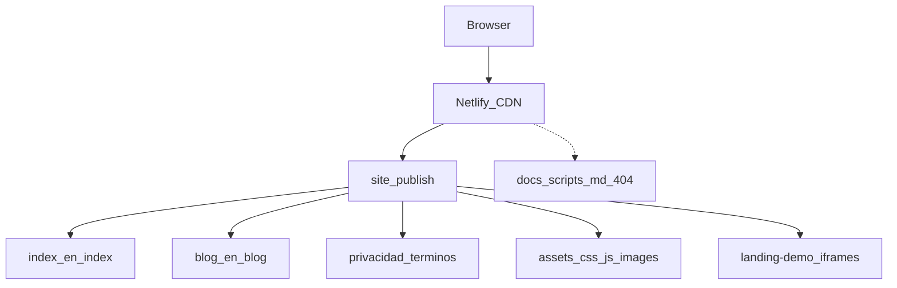

# Architecture — tuko-landing

## Vista general

## Decisiones (2026-10)

| Decisión | Motivo |
|----------|--------|
| `publish = "site"` | No servir docs/scripts/AGENTS en 200 |
| Redirects/headers solo en `netlify.toml` | Evitar deriva `_redirects` / `_headers` |
| Legales en raíz de `site/`; `/pages/*` → 404/301 | Una URL canónica |
| Blog CMS fuera de este repo (Hub) | Landing solo HTML estático; `/_to-migrate/*` → 404 por si quedan URLs viejas |
| GA4 tras consentimiento | RGPD |
| Natrue ES/EN HTML estático | Hub lo despublicó; republicado en Sprint 3 |
| Imágenes WebP + kebab + srcset | Peso ~52 MB → ~2 MB |
| `landing-demo/` dentro de `site/` | Enlazado desde el home |

## i18n

Hoy: diccionarios en `home-ui.js` + `i18n.js` + HTML espejo `site/en/`. Futuro: `docs/I18N-PROPOSAL.md` / Sprint 3 PR E.

## Seguridad

- `.gitignore` cubre `.env*`, `*.pem`, `node_modules`.
- CSP y Permissions-Policy viven en `netlify.toml` (no en `_headers`).
